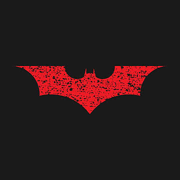
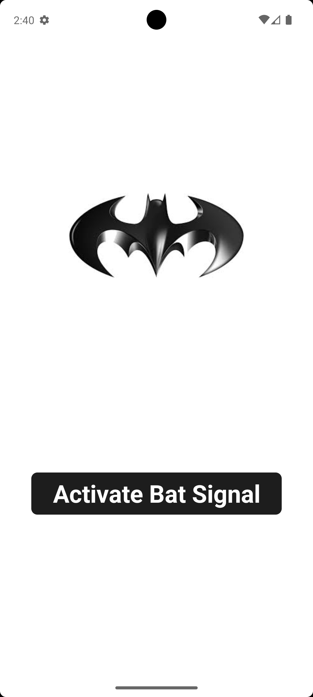
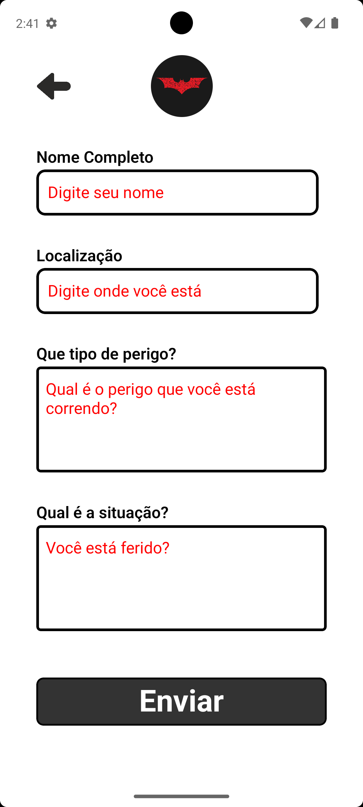

<div style="display: flex; align-items: center; padding: 20px 0;">
  
  <h1>Bat-Sinal App</h1>
</div>


### Uma aplicação mobile desenvolvida em React Native para simular a ativação do Bat-sinal. Ao clicar no botão "Activate Bat Signal", o usuário é direcionado para um formulário de emergência onde poderá informar seus dados e relatar a situação para solicitar a ajuda do Batman. O objetivo principal do projeto é praticar e consolidar conceitos fundamentais do ecossistema React Native e TypeScript.

<br>

## 🚀 Conceitos Praticados

<div style="font-size: 18px">

- **Componentização:** Divisão da interface em componentes menores, isolados e totalmente reutilizáveis.
- **Gerenciamento de Estado Nativo:** Controle de fluxos e alternância de telas "na mão" através de estados (`useState`), sem dependência inicial de bibliotecas de terceiros para navegação.
- **Comunicação entre Componentes (Props):** Passagem de dados e funções (_callbacks_) entre componentes pais e filhos (_Prop Drilling_), fechando o circuito de ações da Home até o botão de voltar.
- **Renderização Condicional:** Exibição dinâmica de componentes com base no estado atual da aplicação.
- **Estilização Modular:** Organização de arquivos de estilo (`Styles.ts`) específicos e isolados para cada componente.
- **TypeScript no Mobile:** Tipagem estrita de propriedades (`types`), funções e eventos de clique para evitar erros em tempo de execução.
</div>
<br>

## 🛠️ Tecnologias Utilizadas
<div style="font-size: 18px">

- [React Native](https://reactnative.dev/)
- [Expo (Managed Workflow)](https://expo.dev/)
- [TypeScript](https://www.typescriptlang.org/)

</div>
<br>

## 📸 Demonstração

Abaixo pode conferir a interface final do aplicativo simulada dentro de molduras de smartphones Android.
<br><br>
<p align="center">
 
  
  
  
</p>

<br><br>

## 📁 Estrutura do Projeto

<p style="font-size: 16px"> A arquitetura do projeto foi estruturada seguindo os padrões de modularidade e clean code, separando a lógica visual das telas principais dos componentes reutilizáveis: </p>

```text
src/
 ├── assets/                 # Imagens, logotipos e ícones (ex: logo-red.jpg, arrow.png)
 ├── components/             # Componentes globais e modulares da interface
 │    ├── BackButton/        # Botão superior esquerdo para retorno à Home
 │    │    ├── BackButton.tsx
 │    │    └── BackButtonStyle.ts
 │    ├── BatButton/         # Botão principal "Activate Bat Signal"
 │    │    ├── BatButton.tsx
 │    │    └── BatButtonStyles.ts
 │    ├── BatLogo/           # Exibição do emblema oficial do Batman
 │    │    ├── BatLogo.tsx
 │    │    └── BatLogoStyles.ts
 │    ├── InputForm/         # Campo de entrada de texto curto com label padronizada
 │    │    ├── InputTextForm.tsx
 │    │    └── InputTextFormStyles.ts
 │    ├── SendButton/        # Botão para envio dos dados coletados no formulário
 │    │    ├── SendButton.tsx
 │    │    └── SendButtonStyles.ts
 │    └── TextArea/          # Campo de texto estendido (Multiline) para descrições longas
 │         ├── TextArea.tsx
 │         └── TextAreaStyles.ts
 └── screens/                # Telas principais (Views) da aplicação
      ├── Home/              # Tela de boas-vindas e ativação do sinal
      │    ├── Home.tsx
      │    └── HomeStyles.ts
      └── FormHelp/          # Tela de captura do formulário de socorro
           ├── FormHelp.tsx
           └── FormHelpStyles.ts
```

## ⚙️ Como Executar o Projeto
<div style="font-size: 16px">
Siga os passos abaixo para clonar e rodar o projeto localmente no seu computador.

Pré-requisitos
Antes de começar, você vai precisar ter instalado em sua máquina:

- Node.js (versão LTS recomendada)

- Um gerenciador de pacotes (npm ou yarn)

- O aplicativo Expo Go instalado no seu smartphone (disponível para Android e iOS).
</div>

## 🚀 Passo a Passo

### 1. Clone o repositório

```bash
git clone https://github.com/seu-usuario/projeto-bat-sinal.git
```

### 2. Acesse a pasta do projeto

```bash
cd projeto-bat-sinal
```

### 3. Instale as dependências:

```bash
npm install
```

### 4. Inicie o servidor de Desenvolvimento Expo

```bash
npm start
```

<p style="font-size: 16px">Testando a Aplicação
No Celular: Abra o aplicativo Expo Go no seu smartphone e escaneie o código QR que aparecerá no terminal do seu VS Code.</p>

<p style="font-size: 16px">No Emulador: Pressione a tecla a no seu terminal para abrir em um emulador Android ou a tecla i para abrir no simulador iOS (requer configuração prévia das ferramentas nativas).</p>

## 📝 Lições Aprendidas & Desafios Técnicos

<div style="font-size: 16px">

- **Tratamento de Textos no TSX / Componentes:** Compreensão profunda sobre a renderização do React Native, onde qualquer caractere textual solto ou quebra de linha mal posicionada fora de uma tag `<Text>` quebra o app com o erro: _“Text strings must be rendered within a `<Text>` component”_.

- **Atenção aos Detalhes de Sintaxe:** Resolução de bugs complexos causados por pequenos caracteres órfãos dentro dos blocos de retorno (como pontos e vírgulas `;` perdidos após o fechamento de inputs), reforçando a importância do processo de depuração (_debugging_) e isolamento de componentes filhos.

- **Componentes Auto-contidos (Self-closing):** Aplicação de boas práticas no fechamento de tags que não recebem conteúdo interno (ex: `<TextArea />`), evitando espaços fantasmas gerados automaticamente pelo editor de código.
</div>
